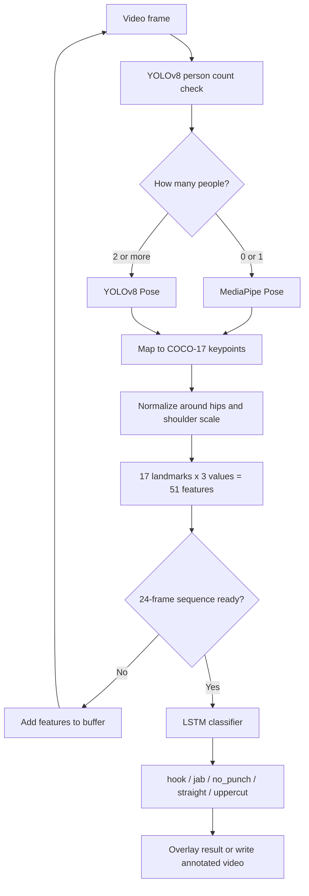
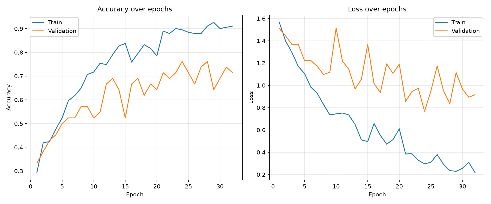
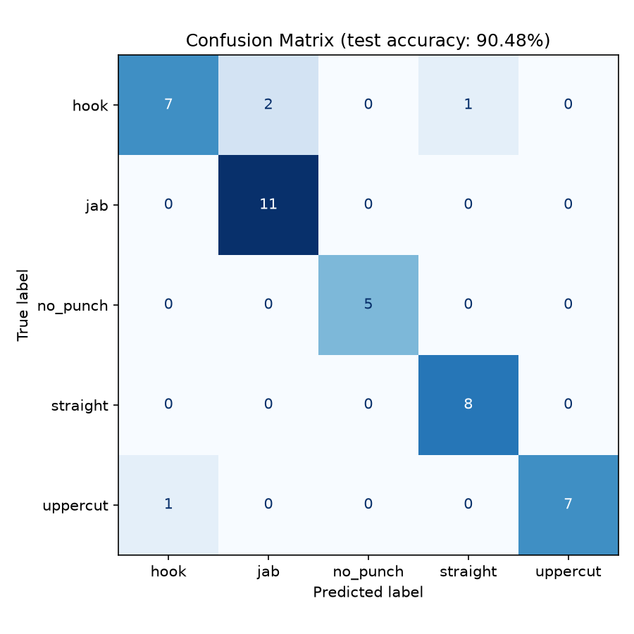
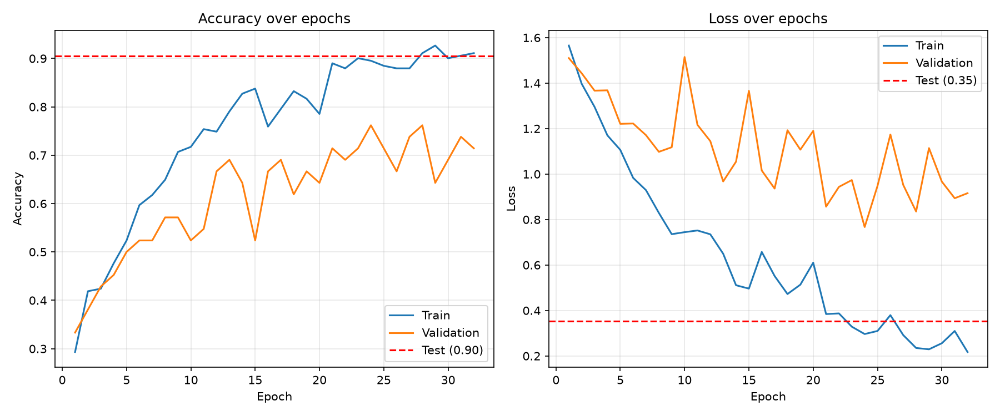

# Martial Art Moves Analyzer

## Project Description

Martial Art Moves Analyzer is a computer-vision project for recognizing martial-arts movements from video. As of now, the project only covers boxing moves. It classifies a sequence as one of five labels:

- `hook`
- `jab`
- `no_punch`
- `straight`
- `uppercut`

The project uses pose landmarks instead of raw image pixels. This makes the classifier focus on body movement and keeps the input to the sequence model compact. The repository contains 275 labeled video clips from youtube, such as hook (63), jab (73), no-punch (30), straight (54), and uppercut (55).

## Workflow and Algorithm

### Flowchart



### Detailed workflow

The complete workflow is implemented mainly in `training.ipynb` and `itungorang.py`:

1. **Read a video.** OpenCV reads each frame from the clips in `data/<label>/`.
2. **Detect people and poses.** `PoseSwitcher` uses YOLOv8 detection to periodically count people. It uses MediaPipe Pose for a single person and YOLOv8 Pose for multiple people. Mode changes use hysteresis to reduce switching caused by an occasional uncertain frame.
3. **Extract pose features.** The MediaPipe landmarks are mapped to the 17-point COCO order used by YOLOv8. Each landmark contributes normalized x and y coordinates plus visibility, producing 51 features per frame. Coordinates are centered at the midpoint of the hips and scaled by shoulder distance.
4. **Create fixed-length sequences.** Detected features from each clip are resampled to 24 frames. The resulting dataset has shape `(275, 24, 51)`.
5. **Train the classifier.** Labels are encoded with `LabelEncoder`. Data is split approximately into 70% training, 15% validation, and 15% test sets using stratification. The model is an LSTM network:

	```text
	Input (24, 51)
	-> LSTM(128, return_sequences=True)
	-> Dropout(0.3)
	-> LSTM(64)
	-> Dropout(0.3)
	-> Dense(32, relu)
	-> Dense(5, softmax)
	```

	Adam optimization, sparse categorical cross-entropy, batch size 16, and early stopping are used during training.
6. **Predict live or from a file.** A rolling 24-frame buffer is classified by the saved LSTM. Predictions are displayed on live webcam frames or written onto an output video.

## Training and Testing Results

Training completed after 32 epochs. The best recorded validation accuracy was **76.19%**. The saved model was evaluated on 42 held-out samples:

| Metric | Result |
| --- | ---: |
| Test loss | 0.353198 |
| Test accuracy | 90.48% |
| Correct predictions | 38 / 42 |

Per-class test performance:

| Class | Precision | Recall | F1-score | Samples |
| --- | ---: | ---: | ---: | ---: |
| hook | 0.88 | 0.70 | 0.78 | 10 |
| jab | 0.85 | 1.00 | 0.92 | 11 |
| no_punch | 1.00 | 1.00 | 1.00 | 5 |
| straight | 0.89 | 1.00 | 0.94 | 8 |
| uppercut | 1.00 | 0.88 | 0.93 | 8 |
| **macro average** | **0.92** | **0.92** | **0.91** | **42** |

### Training curves



### Test confusion matrix and comparison curves





The confusion matrix shows that the main errors were hook samples predicted as jab or straight, and one uppercut predicted as hook. The graphs and saved evaluation data are located in `model/`.

## How to Use

### Install the libraries

Python 3.11 is recommended for the included environment. From the project directory on Windows, create and activate a virtual environment:

```powershell
py -3.11 -m venv .venv
.\.venv\Scripts\Activate.ps1
python -m pip install --upgrade pip
python -m pip install opencv-python numpy mediapipe ultralytics tensorflow scikit-learn matplotlib jupyter
```

The project uses these main libraries:

- **OpenCV** for video capture, resizing, display, and video writing
- **MediaPipe** for single-person pose landmarks
- **Ultralytics YOLO** for person detection and multi-person pose estimation
- **TensorFlow/Keras** for the LSTM classifier
- **NumPy** for feature and model data
- **scikit-learn** for label encoding, data splitting, and evaluation
- **Matplotlib** for training and testing graphs

The YOLO weights `yolov8n.pt` and `yolov8n-pose.pt`, plus the trained files in `model/`, must remain in their existing relative paths.

On MediaPipe versions newer than the one already used by this project, the legacy `mp.solutions.pose` API may be unavailable. The installed project environment was verified with MediaPipe `0.10.21`; pin that version if the import fails:

```powershell
python -m pip install mediapipe==0.10.21
```

### Run realtime webcam analysis

With a webcam connected, run:

```powershell
python realtime.py
```

The program opens a window named **Boxing Analyzer**, displays the current pose mode, predicted label, and confidence, and keeps a rolling 24-frame sequence. Press **q** in the video window to stop it.

For performance, webcam frames are resized to 480 pixels wide for pose processing, the person-count check runs every 15 frames, and the LSTM is evaluated every third frame after the buffer is full. The original frame is kept for display.

### Analyze an uploaded video

Use `analyze_video` with an input path and a separate output path:

```powershell
python -c "from uploadvideo import analyze_video; analyze_video('uploaded.mp4', 'test/uploaded_annotated.mp4')"
```

The output video contains the detected mode and predicted label overlaid on each frame. After processing, the script prints a punch summary for predictions other than `no_punch`.

### Current limitations
- The classifier predicts punch type only. it does not determine left/right hand or target zone.
- `uploadvideo.py` analyzes video, not still photos.
- In multi-person mode, the largest detected person is used as the primary subject for classification. The second person is detected but not classified separately.
- Small dataset
